# PMFlow 架構圖

> 搭配 `SPEC.md` 閱讀。所有圖以 Mermaid 撰寫，GitHub / GitLab / VS Code 皆可直接渲染。

---

## 1. 系統全景圖

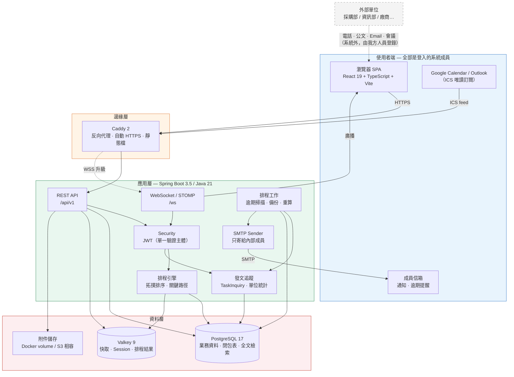

> **外部單位在系統邊界之外。** 他們不登入、不收系統信、不填任何表單。溝通發生在系統外（電話、公文、Email、會議），由我方人員把「提給誰、回了沒、誰回的」登錄進來。這讓整個系統只有一種驗證主體，權限模型維持最簡單的形狀。

---

## 2. 後端分層與模組

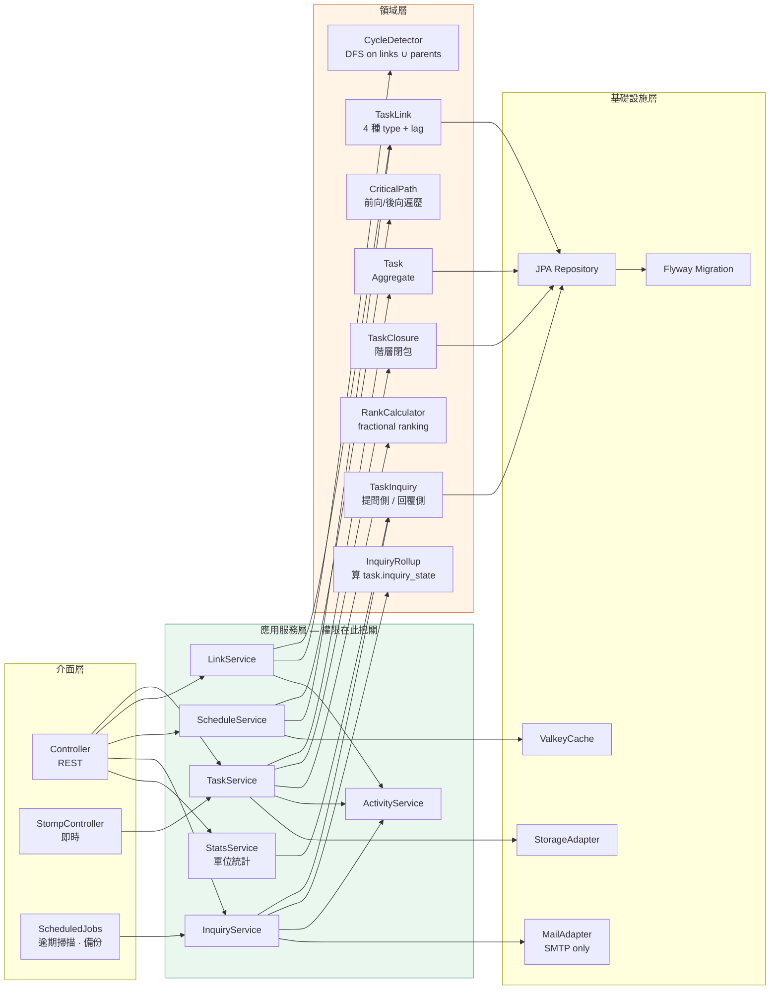

---

## 3. 資料模型 ER 圖

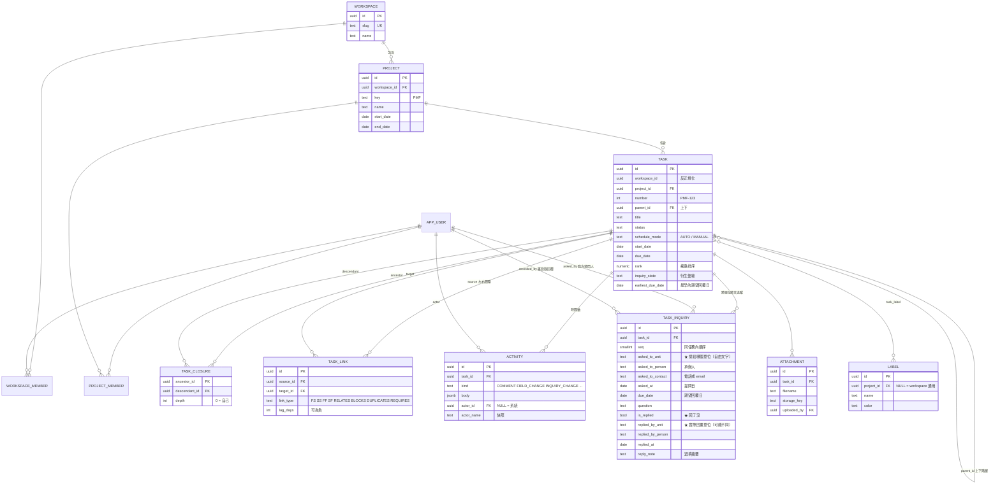

**兩個要注意的設計**：

1. `asked_to_unit` 與 `replied_by_unit` 是**兩個獨立欄位**，不是同一個外鍵。因為實務上「發文給資訊部、由委外廠商回」「案子轉單位」都很常見，共用一欄就記不下這件事。
2. 兩者都是 **`text` 自由文字**，沒有單位主檔。輸入時靠 `v_unit_suggestion` 這個 view 提供歷史值 typeahead——不綁死使用者，又能讓統計不至於太亂。日後想正規化，加一張 `unit_alias` 對照表即可，不用改結構。

---

## 4. 任務「上下左右」關聯示意

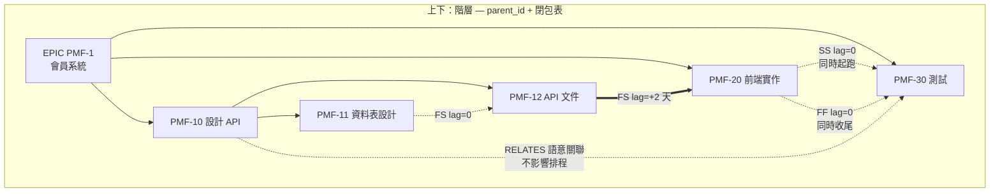

圖例：
- **粗實線（==>）**＝ 排程類依賴，會推動下游日期
- **虛線（-.->）**＝ 語意類關聯，只做關聯與呈現
- **上下箭頭**＝ 父子階層，父任務的日期與完成率由子任務彙總

四種排程依賴的時間軸語意：

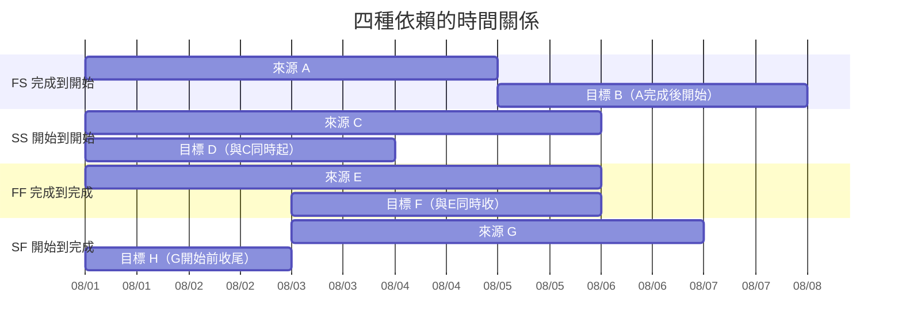

---

## 5. 跨單位發文追蹤流程

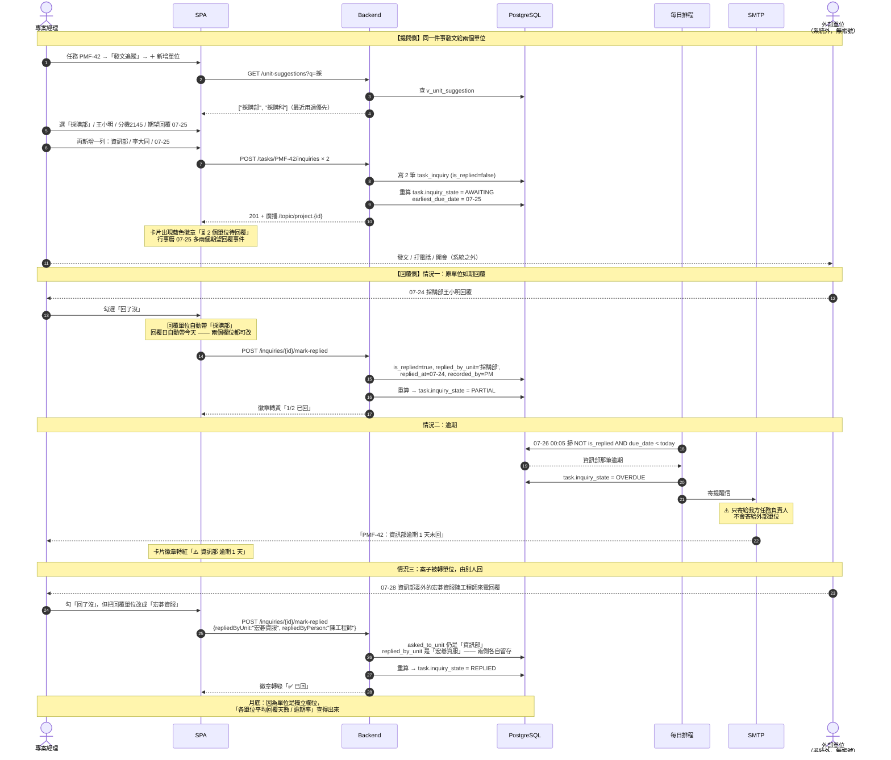

**為什麼提問側與回覆側要分開存**

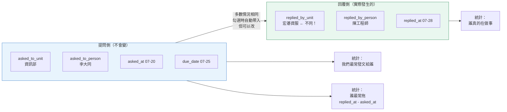

若兩側共用一個欄位，「發文給資訊部但實際是廠商回」這件事就記不下來，而這在機關與大企業裡幾乎是常態。

## 6. 拖曳與樂觀更新協定

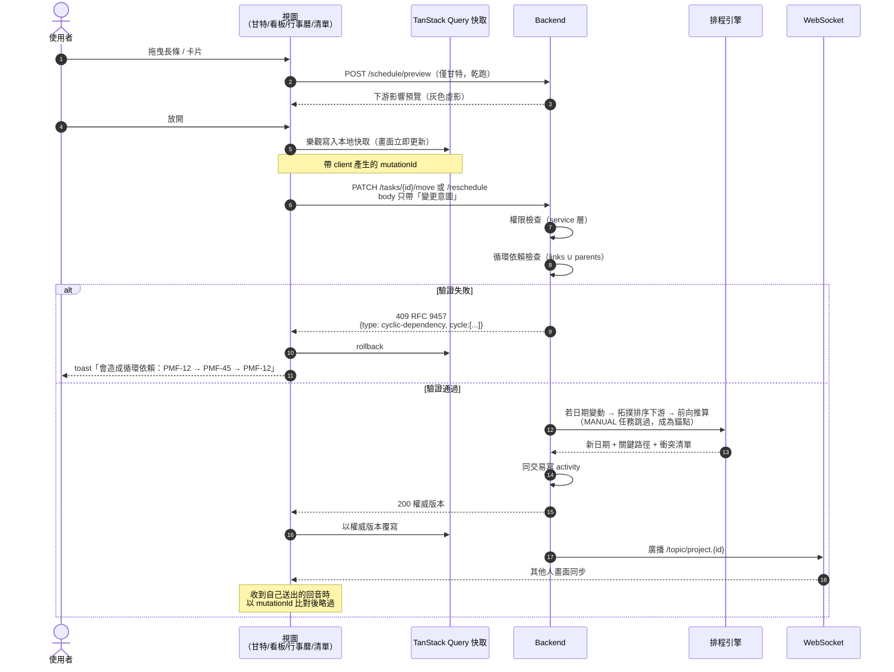

**排序用 fractional ranking**：`rank` 存 `numeric`，插入 A、B 之間時取 `(A.rank + B.rank) / 2`，只 UPDATE 一列。精度降到閾值以下時背景重新平衡整欄。避免「拖一張卡就 UPDATE 整欄」。

---

## 7. 認證與權限管線

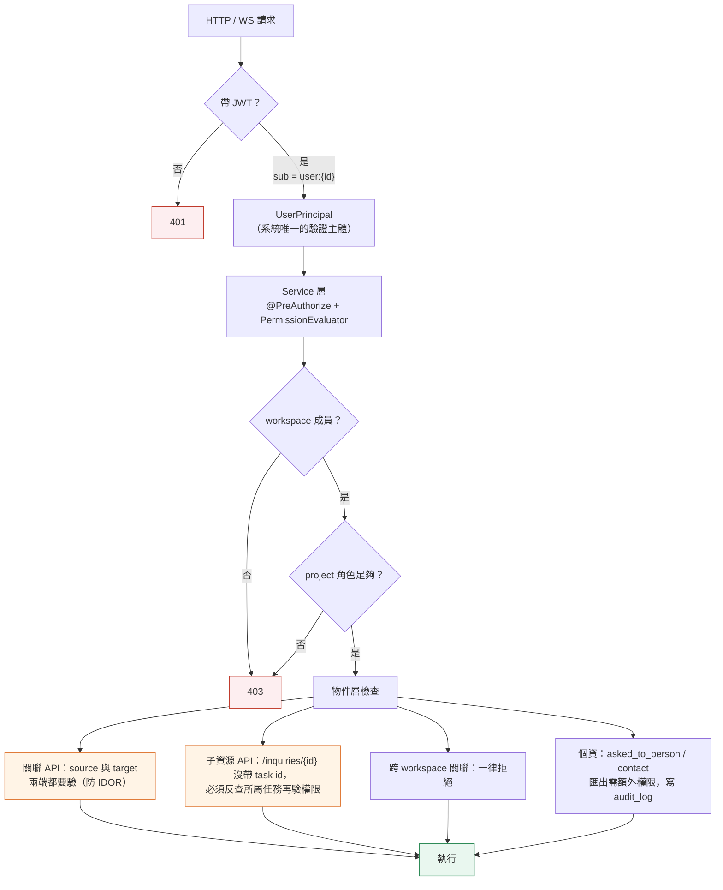

> 因為外部單位不進系統，這條管線只有**一種**驗證主體——沒有訪客、沒有 token 交換、沒有匿名寫入。橘色框是別人踩過的真實漏洞類型（Vikunja 2026 的關聯 IDOR，GO-2026-4847），從第一天設計進去比事後補便宜太多。

## 8. 前端模組圖

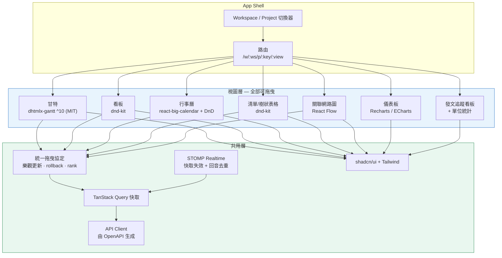

---

## 9. Docker 部署圖（NAS）

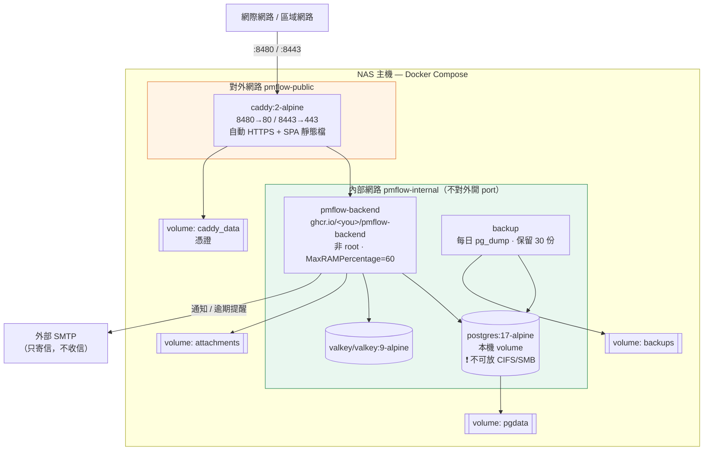

**NAS 五大坑**（詳見 SPEC §12.4）：
1. Synology DSM 佔用 80/443/5000/5001 → 對外改映 8480/8443
2. 不需要設 PUID/PGID —— 全用具名 volume，映像自帶非 root 使用者
3. PostgreSQL 資料**絕不能**放 SMB/CIFS 掛載點
4. `TZ=Asia/Taipei` 要同時給 backend 與 postgres，否則逾期判斷差 8 小時
5. ARM NAS 要確認拉到 `linux/arm64` 映像

---

## 10. CI/CD 流程

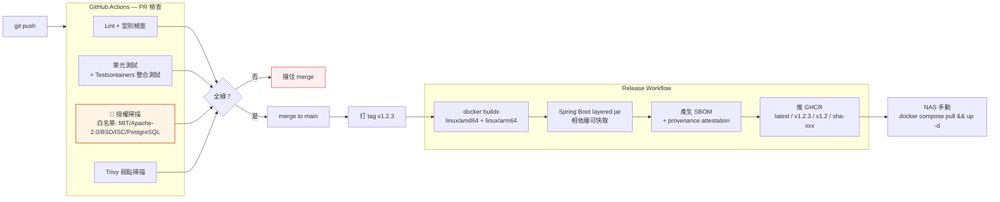

> 授權掃描要在 **M0 階段就建起來**。等專案長大後才發現某個相依是 GPL，拆解成本非常高——WeKan 就是因為甘特函式庫是 GPL，最後只能把甘特功能拆成完全獨立的 repo 分開 build。

---

## 11. 開發里程碑

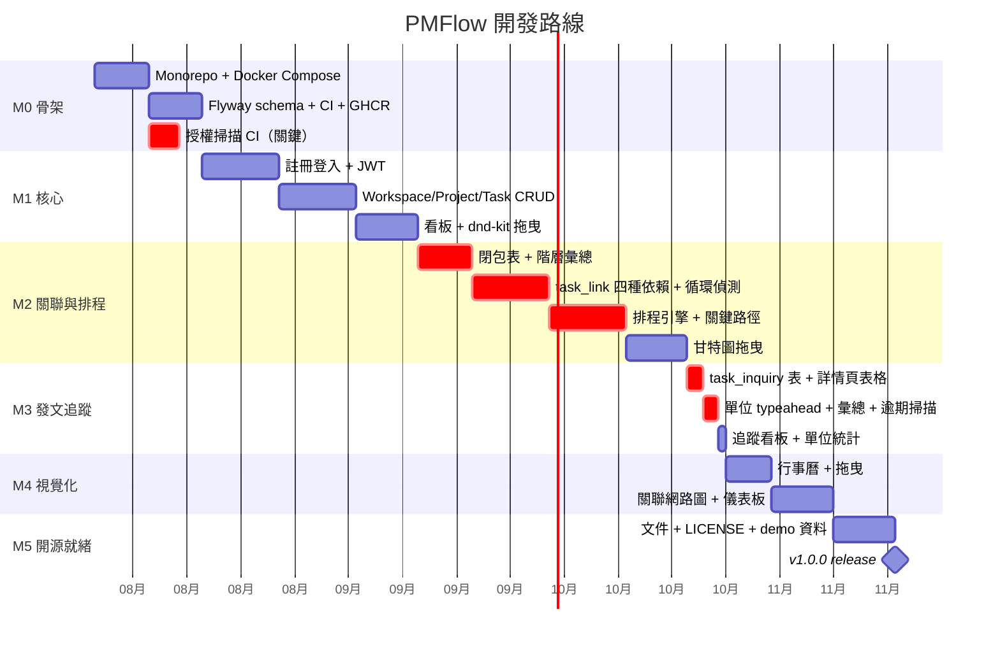
